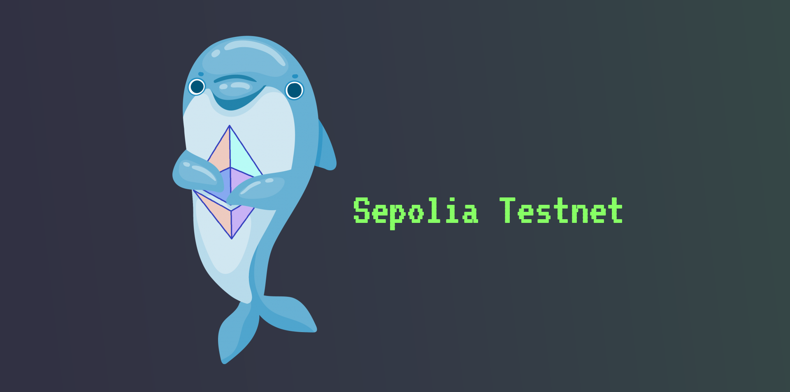

# Desafio: Criação de Token utilizando Metamask e REMIX IDE

Este é um desafio para criar um Token do zero seguindo as instruções do Instrutor Ricardo Zago. O objetivo do desafio é ajudar no entendimento de como funciona a criação de um Token e os passos necessários para fazer o deploy do seu próprio Token.

## Etapas

Para concluir o desafio, foram realizados os seguintes passos:

- criar uma wallet usando MetaMask
- mudar para rede de teste (foi utilizada a rede Sepolia testnet)
- 

    

- encontrar um site que faça fornecimento de sepolia faucet (foi usado: https://sepoliafaucet.com/)
- utilizar o modelo de criação de token (token_model.txt) na IDE Remix para criar um token personalizado

------

## Resultado

